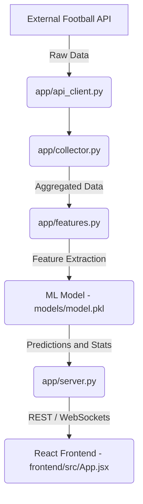

# Live Football Prediction Model

A full-stack machine learning application that predicts the final outcomes (Home, Draw, Away) of football matches in real-time. It continuously ingests live match statistics, uses a trained machine learning classifier against minute-by-minute historical data, and presents live match odds and prediction probabilities via a React frontend.

## 🏗 System Architecture

The project is split into four primary components:

### 1. Data Collection (`app/collector.py` & `app/api_client.py`)
An unattended worker that fetches real-time fixture data, match statistics, and pre-match odds from **API-Football** and **The Odds API**.
- Polls live matches (configurable cadence, e.g., every 10 minutes) and tracks event streams.
- Converts events into minute-by-minute snapshot rows mirroring the training data timing rules.
- Saves raw and expanded minute-by-minute datasets into an SQLite database (`data/live.db`), dynamically building a continually growing dataset for future model retraining.

### 2. Machine Learning Model (`training/train.py` & `models/model.pkl`)
- **Algorithm**: `HistGradientBoostingClassifier` via `scikit-learn`.
- **Training Data**: Trained on `snapshots.csv` (a minute-by-minute snapshot dataset of historical matches). The dataset incorporates time elapsed, goals, cards, and pre-match market odds.
- **Evaluation**: The script splits matches temporally (holding out the most recent 15% of matches) and evaluates model log-loss against the bookmakers' pre-match odds baseline to ensure predictive value.

### 3. Backend API (`app/server.py`)
A lightweight **Flask** web server exposing real-time match data to the frontend:
- `GET /api/fixtures`: Returns today's fixtures (caches daily, overlays live feed).
- `GET /api/live/<fixture_id>`: Returns the live state of a fixture, dynamic model probabilities for Home/Draw/Away outcomes, and historical probability shifts (e.g., how the model adjusted when a goal occurred).

### 4. Frontend (`frontend/`)
A responsive **React** application built with **Vite**.
- Displays today's live and upcoming fixtures.
- Visualizes the live match timeline, real-time in-play statistics (possession, shots, cards), and live model probabilities.

---
## 🏗 High-Level Architecture Diagram

The following diagram illustrates how data flows in real-time from external APIs, through the backend processing and ML layers, and finally to the user interface:


---

## ✨ Key Features

- **Real-Time Probabilities**: The ML model updates its outcome predictions based on real-time match events (goals, red cards, elapsed time) compared to the pre-match market odds.
- **Automated Data Harvesting**: Fully automated ingestion engine designed to run unattended via task schedulers to build up training databases over time.
- **Smart API Quota Management**: Strict caching for fixtures, daily odds, and in-play stats to stay within affordable API usage tiers (100 req/day for API-Football, 500 req/mo for Odds API).

---

## 🚀 Setup & Installation

### Prerequisites
- Python 3.9+
- Node.js 18+
- API Keys:
  - **API_FOOTBALL_KEY**: From [API-Football](https://www.api-football.com/)
  - **ODDS_API_KEY**: From [The Odds API](https://the-odds-api.com/)

Ensure your environment variables are configured:
```bash
# Windows
setx API_FOOTBALL_KEY "your_api_football_key"
setx ODDS_API_KEY "your_odds_api_key"

# Linux/Mac
export API_FOOTBALL_KEY="your_api_football_key"
export ODDS_API_KEY="your_odds_api_key"
```

### 1. Backend Setup
1. Clone the repository and navigate to the root directory.
2. Install Python dependencies:
   ```bash
   pip install -r requirements.txt
   # (If no requirements.txt is present, install the core packages: Flask Flask-Cors scikit-learn pandas numpy requests joblib)
   ```
3. Run the Flask server:
   ```bash
   python app/server.py
   ```
   The backend will start at `http://localhost:5000`.

### 2. Frontend Setup
1. Navigate to the frontend directory:
   ```bash
   cd frontend
   ```
2. Install Node dependencies:
   ```bash
   npm install
   ```
3. Start the Vite development server:
   ```bash
   npm run dev
   ```
   Access the web app via `http://localhost:5173`.

---

## 🤖 Automating the Collector

To build up your own historical dataset over time, you can schedule `app/collector.py` to run daily during active match windows.

**Windows Task Scheduler Example** (run daily at 18:00):
```cmd
schtasks /create /tn "football-collector" /sc daily /st 18:00 /tr "python \"P:\Projects\live football prediction model\app\collector.py\""
```
*Note: Ensure the environment variables for your API keys are set at the system level so the Task Scheduler can access them.*

---

## 🧠 Model Retraining

If you accumulate new data via the collector or have a `snapshots.csv` file ready in the `data/` directory, you can retrain the model to improve accuracy:

```bash
python training/train.py
```
*(Optionally pass a custom CSV path: `python training/train.py path/to/snapshots.csv`)*

The script will:
1. Split the data temporally (holding out the newest 15%).
2. Train the `HistGradientBoostingClassifier`.
3. Output accuracy and log-loss metrics compared to pre-match odds.
4. Save the compiled `.pkl` bundle directly to `models/model.pkl` for immediate use by the backend.

---

## 🛠 Technologies Used

- **Machine Learning**: `scikit-learn`, `pandas`, `numpy`, `joblib`
- **Backend API**: Python, Flask, `requests`, SQLite
- **Frontend UI**: React, Vite, Node.js
- **Data Providers**: API-Football, The Odds API

---
## Comparison With Google's Live Prediction


---

## 🤝 Contributing
Contributions, issues, and feature requests are welcome! Feel free to check the issues page if you want to contribute.

---

## 📄 License
Distributed under the MIT License.

Created by Tinil K Benny
